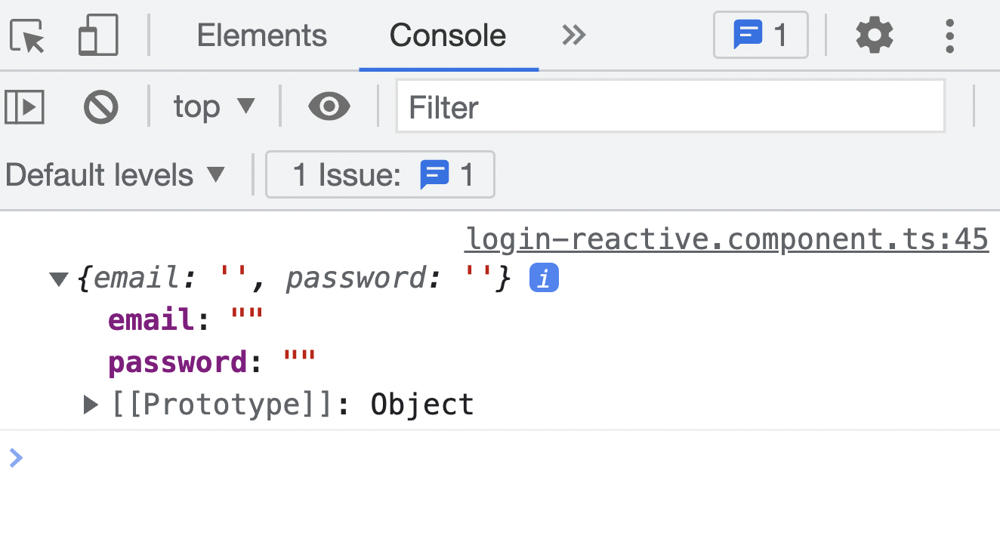

# TypedForm

# Typed a FormControl

- Trong Angular 14, lớp FormControl hiện có kiểu `TValue` chung của TypeScript có kiểu gán mặc định là **any**

- Trước Angular 14, khi truy cập các thuộc tính như `value2`, loại là `any` và khi sử dụng phương thức `setValue`, nó sẽ chấp nhận giá trị đối số `any`.

- Đây chỉ là một số thành viên của lớp đã được cập nhật để sử dụng loại chung `TValue`:
    - `setValue`(value: TValue)
    - `patchValue`(value: TValue)
    - `reset`(formState: TValue)
    - `getRawValue`(): TValue
    - `value`: TValue

> This is a big win for preventing runtime exceptions and regressions due to type errors!

# Typed a FormGroup

- Mục đích của Angular's FormGroup là group form controls một cách hợp lý để theo dõi trạng thái của chúng (giá trị, tính hợp lệ, v.v.) cùng nhau. Angular 14 cũng giới thiệu các kiểu gõ cập nhật cho API FormGroup.

```ts
interface SignUpForm {
  name: string;
  email: string;
  subscribe?: string;
}

const signUpFormGroup = new FormGroup<SignUpForm>({
  name: new FormControl(''),
  email: new FormControl('')
});

const form = this.signUpFormGroup.value;
console.log(form.email);
console.log(form.name);

// The name control's value is typed: string | null
// The email control's value is typed: string | null
// The subscribe control value is typed: string | null | undefined
// The signUpFormGroup value is typed: Partial<{ name: string | null; email: string | null; subscribe: string | null | undefined }>
```
> You may have noticed that the control values can be null or, if optional, undefined. This is because Angular's form APIs **allow for null values**.

> Nếu chúng ta gọi phương thức reset() trên một control, giá trị sẽ không được đặt thành giá trị *gốc/giá trị gốc* mà thay vào đó, nó được đặt thành **null**.

# Typed a FormArray

> Các phiên bản FormArray đã nhập `yêu cầu tất cả các điều khiển đều phải được nhập đồng nhất`. Nếu FormArray yêu cầu các loại không đồng nhất thì nên sử dụng `UntypedFormArray`.


```ts
lineItems = new FormArray([
  new FormControl('')
]);

lineItems.push(new FormControl('')); // SUCCESS
lineItems.push(new FormControl(0)); // ERROR
```

- Nhưng nếu ban đầu mảng điều khiển của chúng ta trống thì sao? Trong trường hợp đó, chúng ta có thể chỉ định loại điều khiển chung:

```ts
lineItems = new FormArray<AbstractControl<string>>([]);
```
# New FormRecord

- Như chúng ta đã tìm hiểu trước đây, FormGroup trong Angular 14+ hỗ trợ chỉ định một nhóm điều khiển có loại TValue được biết khi tạo nhóm, ngay cả khi tạo các điều khiển tùy chọn trong nhóm. 
- Tuy nhiên, còn một nhóm điều khiển mà TValue không được biết khi tạo nhóm thì sao. Để đáp ứng trường hợp sử dụng này, Angular 14 cung cấp một lớp FormRecord mới.


```ts
formGroup = new FormRecord<AbstractControl<string>>({});


// Now that we have created the group of controls using the FormRecord class, we can start to add (and/or remove) controls from the group.
formGroup.addControl('street', new FormControl(''));

// However, what happens if we attempt to add a new control whose TValue is a number?
this.formGroup.addControl('no', new FormControl(0)); // ERROR
```
# Mixing typed and untyped controls

- Chúng ta có thể khai báo các loại controls hỗn hợp khi làm việc với một nhóm controls có kiểu không đồng nhất miễn là chúng ta khai báo các controls khi tạo nhóm. 
- Hơn nữa, chúng ta có thể sử dụng lớp UntypedFormControl để khai báo một controls có loại TValue là any (under the hood, this is a type whose generic type is preset to any).

```ts
export class AppComponent implements OnInit  {
  formGroup = new FormGroup({
    street: new FormControl(''),
    no: new FormControl(0),
    postalCode: new UntypedFormControl()
  });

  ngOnInit(): void {
    const street = this.formGroup.value.street;
    const no = this.formGroup.get('no').value;
    this.formGroup.get('postalCode').setValue(12345);
    this.formGroup.get('postalCode').setValue('ABC123');
  }
}
```
# Non-nullable controls

Nếu bạn nhớ lại phần trước, chúng tôi đã đề cập rằng việc đặt lại trạng thái điều khiển biểu mẫu sẽ đặt giá trị thành null, chứ không phải giá trị ban đầu/giá trị gốc như chúng tôi mong đợi. 

- Với các điều khiển biểu mẫu không thể rỗng, chúng ta có thể hướng dẫn rõ ràng cho trình biên dịch rằng giá trị được đặt lại về giá trị ban đầu khi gọi phương thức reset().

```ts
export class AppComponent implements OnInit {
  formGroup = new FormGroup({
    street: new FormControl('', { nonNullable: true })
  });

  ngOnInit(): void {
    this.formGroup.get('street').reset();
    const street = this.formGroup.value.street;
    console.log(street); // empty string, NOT null
  }
}
```

# The NonNullableFormBuilder service

If you are building a large form where all of its fields are non-nullable, then marking the fields as non-nullable one by one could become quite verbose.

```ts
@Component({
  selector: 'login',
  templateUrl: './login.component.html',
  styleUrls: ['./login.component.css']
})
export class LoginComponent {

   form = this.fb.group({
      email: ["", {
        validators: [Validators.required, Validators.email]
      }],
      password: ["", [Validators.required, Validators.minLength(8)] ]
    });;

  constructor(private fb: NonNullableFormBuilder) {
  }

}
```



As you can see, now all of the fields are considered non-nullable, as they are being reset to their initial value as expected (and not to null).

<https://blog.angular-university.io/angular-typed-forms/>