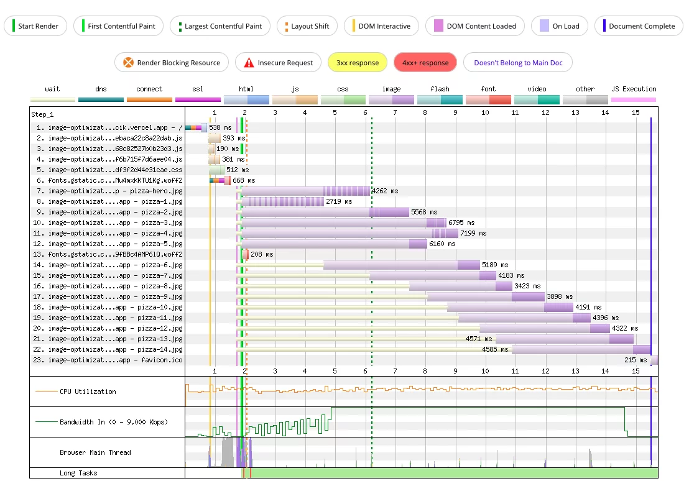
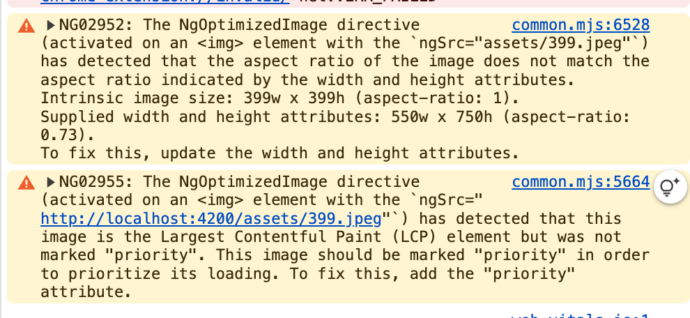
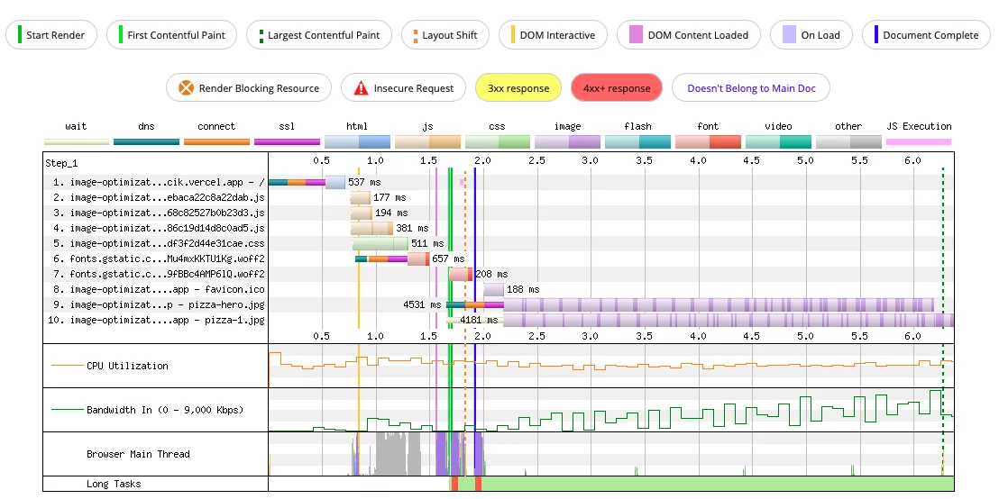
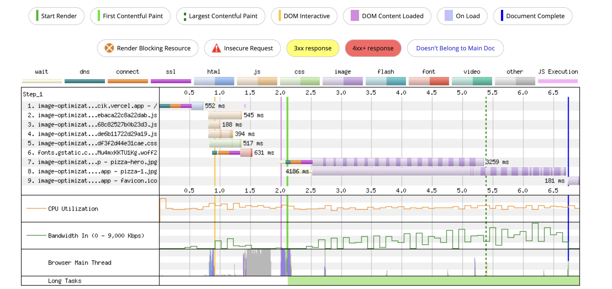
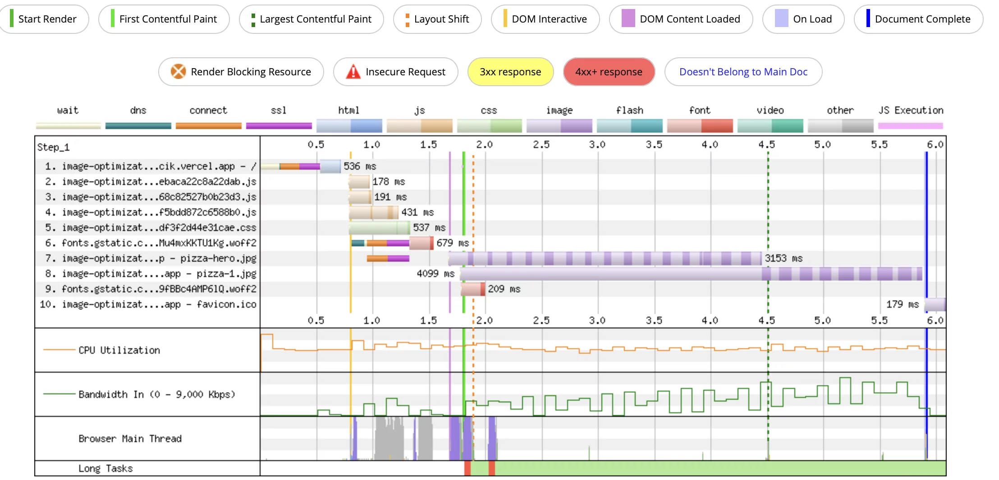
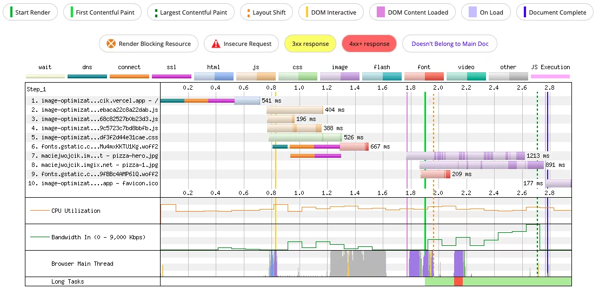

# Image Directive

## Optimizing the LCP in the Angular app

Chúng ta sẽ đi theo từng bước. Cải thiện hiệu suất của ứng dụng từng bước một và đo LCP cho mỗi thay đổi:

The lab environment: 
- Sẽ có 15 hình ảnh (hầu hết các trang có ít nhất 15 hình ảnh), một hình ảnh chính ở trên cùng, sau đó là 14 hình ảnh trong văn bản để minh họa nội dung 
- Hình ảnh sẽ có độ phân giải cao 1920px, khoảng 800kB cho mỗi hình ảnh (hình ảnh này cao hơn trọng lượng trung bình, nhưng tôi muốn sử dụng hình ảnh chất lượng tốt) 
- Chúng tôi sẽ phục vụ chúng ở định dạng jpg từ một máy chủ riêng biệt từ ứng dụng giao diện người dùng của chúng tôi (để có một số độ trễ về lưu lượng truy cập/kết nối khi truy xuất chúng) 
- Việc đo LCP sẽ diễn ra trên hai môi trường: ứng dụng được triển khai trên Vercel và được đo bằng WebPageTest, và ứng dụng được phục vụ trên máy chủ cục bộ, được đo qua Lighthouse trong devtools. 
- LCP kết quả sẽ là trung bình của LCP lấy từ 3 phép đo riêng biệt


### Stage 0: base setup

#### Measure LCP



What conclusions can we come to?

- images are being fetched after downloading and processing all JS, CSS, and font resources
- the LCP element is the pizza-hero.jpg image
- browser waits for 2 seconds before it starts fetching
- in parallel, several images are being downloaded (we may see this by looking at the darker color at the image bar – it indicates when the browser actually downloads the image, while the lighter means the browser requests the download to happen)
- the pizza-1.jpg which is not visible to the user is being fetched & processed before the top image!
- the pizza-hero.jpg takes above 4 seconds to download

#### Conclusions

We can assume, based on the Waterfall View, that we need to optimize the images – by focusing on the top one (pizza-hero.jpg -> LCP element) we could highly improve the LCP. We need to tackle several things, which we will call tasks:

- if possible start requesting the images earlier
- if possible prioritize the hero image to be downloaded first and then download the rest of the images
- if possible request smaller/lighter images to download them faster

```html
<div style="position: relative;">

    

    <h1>Let's talk pizza!</h1>

    <p  style="border: 2px solid red;">
        Lorem ipsum dolor sit amet consectetur adipisicing elit. Voluptatem laudantium earum vero vitae nobis, quam sapiente ipsam accusamus deserunt, maxime at unde magnam libero. Quos sunt earum hic doloribus eveniet assumenda tempora, itaque non mollitia ad rem asperiores beatae? Vitae voluptas dolore ea assumenda doloremque ullam! Mollitia cupiditate id quae nobis quo molestias, ullam eum nihil ab quidem non, deleniti saepe enim aliquam dolorem laborum. Quos esse nostrum fugiat eos temporibus dolor exercitationem ipsum molestiae maxime ex vero sapiente autem quo voluptate ducimus veritatis dolore, repellat, similique impedit. Mollitia tempore aperiam necessitatibus. Nemo ipsa ea natus distinctio voluptas aut fugit.
    </p>

    <section>
        <article *ngFor="let id of ids">
            <p>Lorem ipsum {{id}}...</p>
            
        </article>
    </section>

</div>

```

### Stage 1: Introducing NgOptimizedImage and lazy loading

```html
<-- using ngSrc and witdh/height -->


<-- After render with src -->
"
/>
<-- After render with ngSrc -->
"
/>
```

Clearly, there are four new attributes. These are width, height, loading, and fetchpriority. The width and heightwere added by me, but the loading and fetchpriority are added automatically by the NgOptimizedImage.

The loading attribute tells the browser how to load the image. It can go with:

- `eager` – this is the default one, and it loads the image immediately
- `lazy` – it defers the loading until the time the image will most likely be visible on the user’s screen

Next, we have the fetchpriority which determines in which order the images should be fetched in relation to each other. There are three options:

- `auto` – an automatic priority
- `high` – indicates high-priority images (tải trước các resource khác) - thường dùng cho LCP
- `low` – indicates low-priority images (tải sau các resource khác)

> The directive checks an amazing number of requirements and asserts that it is used in the best way possible. When the required assertion passes it generates HTML attributes, styles rules, srcSets, and creates preload link tags when running with SSR.

Nếu chúng ta không thiết lập bất kỳ điều nào trong số này (width, hight, fill), lệnh sẽ đưa ra thông báo lỗi giải thích chi tiết về yêu cầu đó.

Ngoài ra, nếu cài đặt chiều rộng và chiều cao của chúng ta khiến hình ảnh bị méo mó – ví dụ khi chiều rộng và chiều cao dẫn đến tỷ lệ khác với tỷ lệ hình ảnh thực tế – lệnh sẽ cảnh báo chúng ta về điều đó và giúp khắc phục.



> In total, the directives can throw 13 runtime errors when required assertions fail, and 6 warnings to ensure best practices.

Giao tiếp thú vị như vậy với nhà phát triển tạo nên trải nghiệm phát triển tuyệt vời và đảm bảo mọi phương pháp hay nhất. Theo quan điểm của tôi, đây thực sự là chỉ thị tiên tiến ở nhiều khía cạnh — bao gồm cả DX.

#### Measure LCP

- In the Waterfall, we can see the regression. Even the favicon is loaded before the images on the page. Both pizza-hero.jpg and pizza-1.jpg images are being downloaded simultaneously. 
- **The only good thing is** the other images are not fetched at all! And this is great because they are not visible on the screen (they are way below) so there is no point in fetching them at init.



#### Conclusions
- We can be sure that the lazy-loading which comes by default with NgOptimizedImage works — the images visible on the viewport (or nearly visible) are the only ones being fetched.
- Lý tưởng nhất là chúng ta muốn duy trì lazy-loading cho tất cả các hình ảnh ngoại trừ pizza-hero.jpg là phần tử LCP của chúng ta và chúng ta muốn ưu tiên tải nó. Trong quá trình này, chúng ta vẫn cần phải xử lý các kết luận từ giai đoạn trước:
  - if possible start requesting the hero image earlier
  - if possible prioritize the hero image to be downloaded first and then download the rest of the images
  - if possible request smaller/lighter images to download them faster

### Stage 2: Prioritize LCP element

Bây giờ, khi chúng ta đã triển khai chỉ thị, việc tối ưu hóa nó sẽ dễ dàng hơn. Chúng ta chỉ cần làm theo các gợi ý từ chính chỉ thị và xử lý danh sách nhiệm vụ của mình. Chúng ta sẽ bắt đầu với vấn đề ưu tiên. Bạn có thể đánh dấu đây là một nhận xét chung — nếu phần tử LCP của bạn là hình ảnh, bạn nên ưu tiên tải hình ảnh đó.


Để thực hiện điều này với `NgOptimizedDirective`, chúng ta cần thêm thuộc tính `priority` vào khai báo.

```html


<article *ngFor="let the image of images">
	<p>Lorem ipsum ...</p>
	
</article>
```

> Please note, that we added the priority attribute only to the first image — which in our case is the LCP element.

#### Understanding priority attribute

The `priority` attribute was added, but it is only a **directive internal input**. The essential change is actually in the `fetchpriority` attribute. Its value was changed from `auto` to `high`. **This is the real deal**, and we should see an improvement in the measurements.

```html
<-- no priority -->


<-- priority -->

```

Không có thay đổi nào khác, chỉ thị chỉ cập nhật fetchpriority dựa trên biến đầu vào priority. Nó cũng sẽ cảnh báo chúng ta về việc không có thẻ preconnect cho hình ảnh priority. Chúng ta sẽ nghĩ về điều đó trong phần kết luận.

#### Measure LCP

The Lighthouse run indicated an LCP of around 20.8 seconds, so lower than the previous one and exactly the same as our base implementation. Not much improvement so far, but when looking at the WebPageTest we got 6.0s LCP, which is the lowest result so far. Let’s take a closer look at the Waterfall:



> Có hai kết quả rõ ràng. Đầu tiên, pizza-hero.jpg cuối cùng được ưu tiên và lấy hoàn toàn trước khi chuyển sang pizza-1.jpg. Thứ hai, hình ảnh anh hùng của chúng ta cuối cùng đã đánh bại favicon trong ra

#### Conclusions

Chúng ta hãy phân tích Waterfall nhiều hơn — có một khoảng cách khá lớn giữa việc khởi tạo tài nguyên lấy vào khoảng 1,5 giây và bắt đầu lấy hình ảnh anh hùng. Quá trình tải xuống thực tế bắt đầu trong 2,5 giây, quá muộn.

> Giữa 2.0 và 2.5 thứ hai, có ba thứ đang diễn ra – `DNS`, conn`ect` và `SSL`. ` Ba tác vụ này chỉ đơn giản là thiết lập kết nối với máy chủ bên ngoài, nhưng không thực sự tải xuống bất cứ thứ gì. Chúng ta không thể thúc giục JS chạy ứng dụng Angular của mình nhanh hơn và biết một cách kỳ diệu rằng anh ta phải tải xuống hình ảnh anh hùng,` **nhưng chúng ta có thể cho trình duyệt biết rằng phần "kết nối" có thể được thực hiện càng sớm càng tốt** trong khi chờ JS quyết định tải xuống cái gì.
>
> Vấn đề này có thể được giải quyết bằng cách thêm liên kết thẻ preconnect và chỉ thị thực sự thông báo về điều đó trong cảnh báo.

Let us go back, and check the progress on the previous conclusions:

- ✅ if possible start requesting the hero image earlier
- ✅ if possible prioritize the hero image to be downloaded first, and then download the rest of the images
- if possible request smaller/lighter images to download them faster

### Stage 3: Preconnect

Bài viết này giải thích chi tiết về cơ chế `preconnect`. Đối với chúng tôi, điều quan trọng là phải hiểu rằng chúng tôi có thể gợi ý cho trình duyệt về các tài nguyên. Vì vậy, nếu chúng tôi chắc chắn rằng chúng tôi sẽ lấy tài nguyên từ một số máy chủ và trình duyệt sẽ phải thiết lập kết nối, chúng tôi có thể thông báo điều đó cho trình duyệt khi bắt đầu.

Kỹ thuật này thực sự rất đơn giản – chỉ cần thêm một phần tử liên kết vào trang <head>. Hãy xem đoạn trích sau:

```html
<link rel="preconnect" href="<https://example.com>" />
```

Đó chính xác là những gì chúng ta sẽ làm trong bước tối ưu hóa này. Tài nguyên của chúng ta được lưu trữ trong một ứng dụng được triển khai trên Vercel và đó là nơi chúng ta sẽ trỏ thẻ preconnect của mình đến. Vì vậy, trong index.html, chúng ta sẽ thêm một dòng nữa vào phần tử <head> của trang.

```html 
<link rel="preconnect" href="<https://image-optimization-app.vercel.app>" />
```

<link rel="preload" as="image" href="assets/399.jpeg">

- Yêu cầu browser tải ngay resource
- Download resource càng sớm càng tốt
- Thường dùng cho:
  - Critical resources
  - LCP images
  - Fonts quan trọng
  - Resource sẽ được tải ngay, bất kể có dùng hay không


<link rel="preconnect" href="https://example.com">

- Chỉ thiết lập kết nối sớm đến domain
- KHÔNG tải resource
- Bao gồm:
  - DNS lookup
  - TCP handshake
  - TLS negotiation (nếu là HTTPS)
  - Thường dùng cho third-party domains

```html
<!-- CÁCH SỬ DỤNG ĐÚNG -->

<!-- Preload critical image -->
<link rel="preload" as="image" href="assets/hero.jpg">

<!-- Preconnect to third-party domain -->
<link rel="preconnect" href="https://fonts.googleapis.com">
<link rel="preconnect" href="https://analytics.google.com">
```

#### Measure LCP

Alright, let’s check the results. Lighthouse on localhost results in the very same time as in the previous step, so the 20.8 seconds. However, the WebPageTest reports a significant decrease! We have lowered the LCP from 5.4s to 4.5s. `This is great! I’m not sure why the localhost app is not influenced by this change, and without such a detailed waterfall graph for localhost, I’m unable to figure out a reason.` Maybe somehow the connection was cached.



> Biểu đồ cho thấy rõ ràng rằng chúng tôi đã thành công trong việc thiết lập kết nối trước đó. Các tác vụ DNS + connect + SSL cho các tài sản hiện được thực hiện trước khi tải xuống tài nguyên thực tế. Trên thực tế, nó được thực hiện cùng lúc khi các tệp quan trọng của JS đang được tải xuống.

#### Conclusions

> Vì giai đoạn thiết lập kết nối xảy ra sớm hơn, hình ảnh có thể được tải xuống ngay khi ứng dụng nhận ra cần hiển thị tài nguyên. **Chúng ta không thể tăng tốc thêm nữa, nhưng chúng ta có thể yêu cầu hình ảnh nhỏ hơn/nhẹ hơn để tải xuống nhanh hơn.**

### Stage 4: Responsive images

Không có ích gì khi cung cấp hình ảnh 4K cho trình duyệt nếu khung nhìn của người dùng có độ phân giải khoảng 500px. Dù sao thì người dùng cũng sẽ không thấy sự khác biệt, nhưng sẽ phải đợi lâu hơn đáng kể để tải xuống tài nguyên — đặc biệt là trên các kết nối chậm hơn (di động).

Đồng thời, chúng tôi không muốn luôn cung cấp hình ảnh có độ phân giải thấp, tải nhanh trên thiết bị di động nhưng chất lượng thấp trên máy tính để bàn. Nói về thời gian tải xuống và chất lượng hình ảnh, chúng tôi chắc chắn muốn ăn bánh và cũng muốn có nó!

Làm thế nào chúng ta có thể phục vụ các hình ảnh khác nhau tùy thuộc vào kích thước màn hình? Phần tử hình ảnh có một thuộc tính được gọi là srcset, được mô tả chi tiết tại đây. Về cơ bản, nó chỉ định các tài nguyên hình ảnh khác nhau với một số quy tắc mô tả thời điểm áp dụng tài nguyên. Có hai cách để mô tả quy tắc. Chúng ta có thể sử dụng mật độ điểm ảnh hoặc kích thước chiều rộng chính xác và cung cấp thêm thuộc tính sizes để chỉ định chiều rộng bố cục.

Hy vọng rằng, chỉ thị này một lần nữa giúp chúng ta thực hiện điều đó và tự động tạo `srcset`. Có một số cách chúng ta có thể triển khai kỹ thuật đó:

- tự động tạo srcset — dựa trên các thuộc tính width và height. Điều này không hiệu quả với hình ảnh phản hồi. Nó sẽ tạo ra các tài nguyên srcset khác nhau dựa trên mật độ pixel, nhưng không phải các kích thước màn hình khác nhau.
- tạo srcset tự động — dựa trên thuộc tính sizes. Điều này hoạt động với hình ảnh phản hồi vì nó cập nhật srcset để hoạt động với các kích thước màn hình khác nhau, sử dụng các điểm dừng phản hồi. Các điểm dừng được cung cấp theo mặc định, nhưng bạn có thể ghi đè chúng nếu bạn muốn đặt một số điểm dừng kích thước màn hình cụ thể.
- khai báo srcset theo cách thủ công — đây cũng là phiên bản thân thiện với nhà phát triển và chúng ta không phải đưa toàn bộ mã mẫu vào mà chỉ cần chỉ định kích thước mà lệnh sẽ tạo ra srcset hoàn chỉnh

Chúng tôi sẽ sử dụng hình ảnh phản hồi đầy đủ, dựa trên kích thước màn hình. Trong ứng dụng của chúng tôi, hình ảnh luôn chiếm toàn bộ chiều rộng màn hình, vì vậy chúng tôi cần đưa điều đó vào phương pháp của mình. Chúng tôi sẽ thực hiện hai thay đổi:

```html


<article *ngFor="let the image of images">
	<p>Lorem ipsum ...</p>
	
</article>
```

> Tại sao chúng tôi lại thay đổi cách tiếp cận từ `width` và `height` cố định sang `fill`? Đó là vì trong ứng dụng của chúng tôi, hình ảnh luôn chiếm toàn bộ chiều rộng và điều này sẽ dẫn đến nhu cầu về hình ảnh khác nhau dựa trên kích thước khung nhìn, ví dụ trên kích thước màn hình di động, chúng tôi có thể cần tải xuống hình ảnh nhẹ hơn so với trên máy tính để bàn lớn.

Tất nhiên, bất kể chúng ta chọn phương pháp tạo srcset nào, chúng ta vẫn cần tạo và phục vụ các tài nguyên này, điều này có thể rất tẻ nhạt. Đó là lý do tại sao chúng ta sẽ sử dụng `Imgix`. Đây là một nền tảng CDN, giúp tối ưu hóa hình ảnh cho chúng ta. CDN sử dụng một định dạng URL cụ thể để lấy tài nguyên cho một `srcset` nhất định, thông tin thêm về điều đó có tại đây. Theo cách đó, tôi không phải tự tay tạo nhiều phiên bản khác nhau của hình ảnh pizza-hero.jpg của mình, **mà chỉ cần tải hình ảnh đó lên `Imgix` rồi yêu cầu các tài nguyên cụ thể.**

Tôi đã chọn Imgix làm nhà cung cấp dịch vụ hình ảnh của mình, vì đây là một trong những CDN mà Angular hỗ trợ tự động với các trình tải được cấu hình sẵn và tôi không cần phải viết bất kỳ mã bổ sung nào. Tôi sẽ giải thích cách tạo các trình tải tùy chỉnh sau, nhưng bây giờ, chúng ta hãy cùng tìm hiểu cách dễ nhất.

To set up the CDN to work automatically with the `NgOptimizedImage`, producing the srcset we need to `provide` the loader in the `providers` array (in your ngModule or standalone component):

```ts
providers: [provideImgixLoader("<https://my.base.url/>")];
```

Để lấy một hình ảnh, ví dụ như pizza-hero.jpg, tôi cần lấy tài nguyên từ https://maciejwojcik.imgix.net/pizza-hero.jpg và vì tuyến đường cơ sở đã được cung cấp trong trình tải Imgix, nên không cần phải lặp lại trong lớp thành phần. Điều đó đơn giản hóa các khai báo tài sản của chúng tôi, chỉ còn tên tài sản:

```ts
@Component({
  selector: 'app-root',
  templateUrl: './app.component.html',
})
export class AppComponent {
  readonly heroImage = 'pizza-hero.jpg';
  readonly images = [
    'pizza-1.jpg',
    'pizza-2.jpg',
		...
  ];
}
```

- state 2 and 3

```html
"
/>
```

- state 4:

```html
"
	srcset="
		<https://maciejwojcik.imgix.net/pizza-hero.jpg?auto=format&amp;w=640>   640w,
		<https://maciejwojcik.imgix.net/pizza-hero.jpg?auto=format&amp;w=750>   750w,
		<https://maciejwojcik.imgix.net/pizza-hero.jpg?auto=format&amp;w=828>   828w,
		<https://maciejwojcik.imgix.net/pizza-hero.jpg?auto=format&amp;w=1080> 1080w,
		<https://maciejwojcik.imgix.net/pizza-hero.jpg?auto=format&amp;w=1200> 1200w,
		<https://maciejwojcik.imgix.net/pizza-hero.jpg?auto=format&amp;w=1920> 1920w,
		<https://maciejwojcik.imgix.net/pizza-hero.jpg?auto=format&amp;w=2048> 2048w,
		<https://maciejwojcik.imgix.net/pizza-hero.jpg?auto=format&amp;w=3840> 3840w
	"
	style="position: absolute; width: 100%; height: 100%; inset: 0px;"
/>
```



Depending on the attributes we provide, the automatic srcset generation differs slightly.

- when we provide `width` & `height` — it means we want a fixed size, but depending on the pixel density we may still need to fetch different resources. It generates a srcset for two density const values: 1 and 2 adding them to the sources list, with the density value and width multiplied by the density.
- when we provide `fill` — it means we want a responsive image, and we should specify the sizes attribute (although it’s not required and will assume 100vw by default). It will generate the `srcset` value, by mapping the breakpoints (Angular specifies them by default, but we can override them if we want) to the sources list, and filtering them before based on the sizes value.
- when we provide `ngSrcset` attribute — the directive will generate srcset value based on the ngSrcset and widthif it won’t already be provided in the ngSrcset string.

## Overall LCP improvement

Chúng tôi đã cải thiện được LCP từ 6,2 giây lên 2,7 giây khi đo bằng WebPageTest và từ 20,8 giây lên 17,5 giây trong thử nghiệm Lighthouse chạy trên localhost. Đây là một kết quả tuyệt vời và như tôi đã đề cập, chúng tôi thực sự gần với mục tiêu được gọi là thời gian tốt cho LCP (2,5 giây).

Mặc dù ứng dụng localhost chậm hơn nhiều so với ứng dụng được triển khai trên Vercel và được thử nghiệm qua WebPageTest, nếu chúng ta so sánh xu hướng, kết quả sẽ tương tự. Cả hai thử nghiệm đều xác nhận rằng chỉ thị thực hiện công việc đáng kinh ngạc với việc tối ưu hóa LCP, ngay khi chúng ta bắt đầu tối ưu hóa phần tử LCP. Trong cả hai trường hợp, chúng tôi đều có sự gia tăng nhỏ trong LCP, khi chúng tôi sử dụng cài đặt mặc định, để tải chậm tất cả các phần tử.

> Hãy nhớ rằng trong toàn bộ thử nghiệm này, chúng tôi không sử dụng bất kỳ kiến ​​thức nâng cao nào về LCP, cải tiến hiệu suất và API hình ảnh trình duyệt. Chúng tôi chỉ đơn giản làm theo các đề xuất từ ​​NgOptimizedDirective và chúng tôi đã đi từ LCP thực sự tệ đến gần như hoàn hảo.

## Additional loaders

## Reference

In-depth: <https://angular.love/improve-page-performance-and-lcp-with-ngoptimizedimage>

Almanac: <https://almanac.httparchive.org/en/2022/media#embedding>

Install WebPageTest: https://github.com/catchpoint/WebPageTest/blob/master/docker/local/README.md