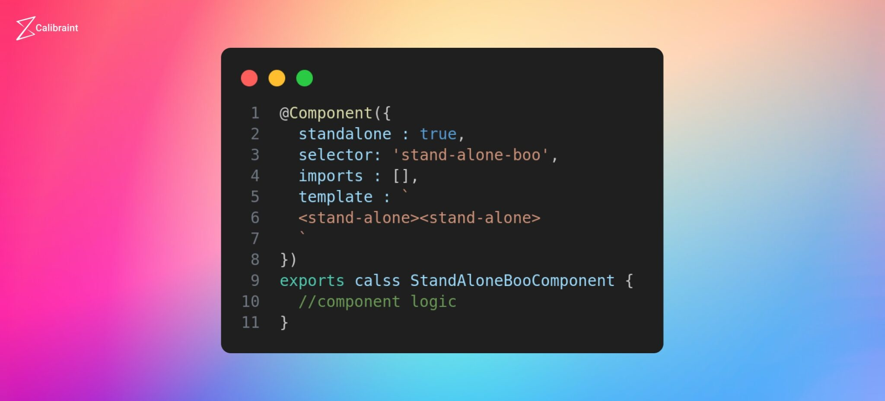
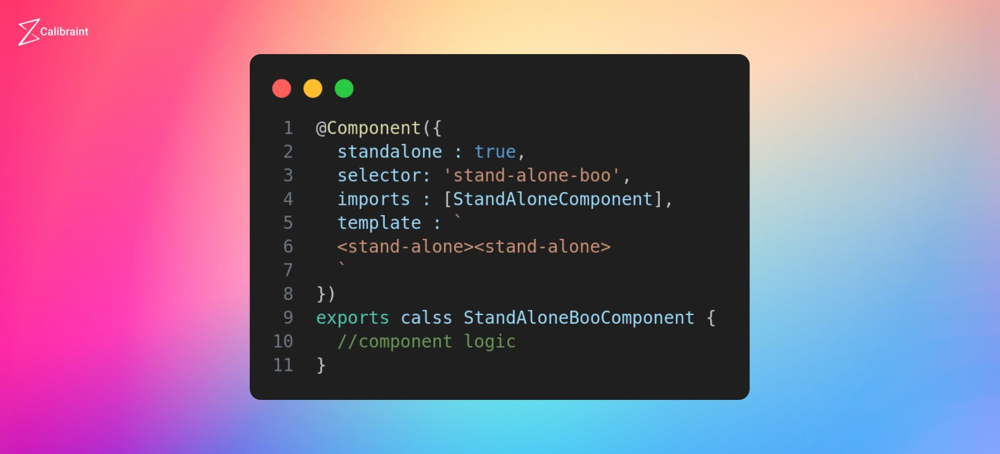

# Automatic Imports In Language Service

Các tính năng mới của Angular 15 hiện cung cấp khả năng tự động nhập các thành phần được sử dụng trong các mẫu nhưng chưa được thêm rõ ràng vào các thành phần độc lập hoặc NgModules. Tính năng này đơn giản hóa quy trình phát triển bằng cách tự động giải quyết và nhập các thành phần cần thiết, giảm nhu cầu nhập thủ công.

Trong mẫu, lỗi sẽ được hiển thị khi sử dụng bộ chọn độc lập mà không nhập thành phần tương ứng. Tuy nhiên, dịch vụ ngôn ngữ Angular cung cấp tùy chọn sửa lỗi nhanh tự động nhập thành phần cần thiết vào phần nhập. Sau khi áp dụng sửa lỗi nhanh, mã sẽ được cập nhật để bao gồm câu lệnh nhập cho thành phần, do đó giải quyết được lỗ

