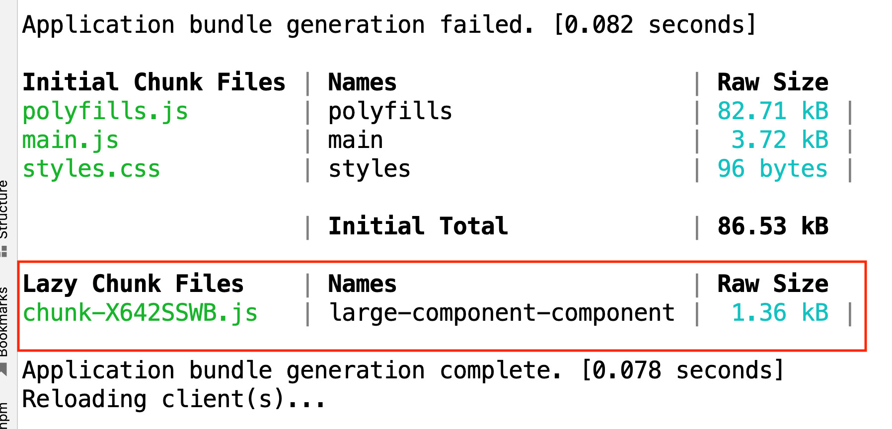

# Angular @defer: Complete Guide

Một trong những phương pháp hiệu quả nhất để cải thiện hiệu suất của một ứng dụng một trang là trì hoãn việc tải các tài nguyên không quan trọng càng nhiều càng tốt.

Các tài nguyên quan trọng nên được tải trước, trong khi các tài nguyên khác ít quan trọng hơn nên được tải sau, chỉ khi và nếu cần.

Rất có thể một phần lớn cơ sở mã của bạn không cần thiết cho một phiên người dùng điển hình.

Vậy tại sao lại tải mã mà chúng tôi không chắc chắn 100% rằng chúng tôi sẽ cần? Tải mã không cần thiết chỉ làm chậm ứng dụng của chúng ta.

Cho đến nay, Angular đã có một cơ chế tích hợp chính để tránh tải các tài nguyên không cần thiết: `router-based lazy loading`

> Cơ chế này rất mạnh mẽ, nhưng nó có một hạn chế: nó không cho phép lười tải các phần của một mẫu nhất định.

Nhưng điều gì sẽ xảy ra nếu bạn có một màn hình lớn với nhiều phụ thuộc và bạn muốn tải các phần của trang không hiển thị ngay lập tức trong nền, trong khi bạn đợi người dùng cuộn xuống trang hoặc nhấp vào một nút?

Loại tải trì hoãn rất chi tiết này không thể thực hiện được với `router-based lazy loading`

But that is exactly where `@defer` comes in!

@defer allows all of those scenarios and much more.



## What is @defer, and why do we need it?

> @defer là một cú pháp mẫu Angular, cho phép bạn chỉ tải các phần của mẫu khi chúng cần thiết, với một điều kiện logic.

Cú pháp @defer cho phép chúng ta triển khai các trường hợp sử dụng phổ biến như:

- Chỉ tải một thành phần lớn sau khi người dùng cuộn xuống trang sau một thời điểm nhất định
- Chỉ tải một thành phần lớn sau khi người dùng nhấp vào một nút
- Tải trước một thành phần lớn trên nền trong khi người dùng đang đọc trang, để nó sẵn sàng vào thời điểm người dùng nhấp vào một nút

Cú pháp @defer cung cấp cho chúng ta hai cấp độ kiểm soát quá trình tải một phần tài nguyên:

- Chúng ta có thể kiểm soát khi nào mã được tìm nạp từ backend, và điều này được gọi là prefetching.
- Chúng ta cũng có thể kiểm soát riêng khi mã đó được áp dụng cho trang

Bạn có thể muốn tải một số mã trên nền dự đoán rằng nó sẽ sớm cần thiết, nhưng bạn không cần phải hiển thị mã đó ngay sau khi nó được tải.

Bạn có thể muốn đợi một sự kiện nhất định xảy ra, chẳng hạn như người dùng nhấp vào một nút, trước khi bạn hiển thị mã.

Với @defer chúng ta có thể xác định các yếu tố kích hoạt cho từng bước trong số hai bước này một cách riêng biệt.

`We can use predefined triggers, but we can also define our custom triggers if needed.`

## @defer in action

Hãy tưởng tượng rằng thành phần của bạn có một số mã sẽ luôn được hiển thị, nhưng sau đó có một phần của trang chỉ cần thiết trong một số trường hợp nhất định.

Phần không cần thiết đó chứa một thành phần lớn, mà chúng ta muốn tải trên nền.

Here is a simple example of that component:

```ts
@Component({
  selector: "large-component",
  template: ` <h2>large-component is displayed...</h2> `,
})
export class ExampleComponent {}
```

Just imagine that this is a massive component, that internally uses **chart libraries and other heavy dependencies.**

-> Chúng tôi muốn trì hoãn việc tải thành phần lớn này cho đến khi chúng tôi chắc chắn 100% rằng người dùng cần nó.

To control when that large component gets loaded in our application, start by wrapping it in a @defer block:

```ts
@Component({
  selector: "app",
  template: `
    <h2>Some content that will always be displayed ...</h2>

    @defer {
        <large-component />
    }
  `,
})
export class AppComponent {}
```

> Điều này sẽ cho Angular biết rằng phần @defer của trang nên được đóng gói thành một gói Javascript riêng biệt và được tải riêng biệt.

You can see the immediate effect of the presence of the @defer block in the Angular CLI build output: 


This means that large-component and all its dependencies have been extracted from the main application bundle, and are now part of a separate bundle.

So the main application bundle now is smaller, and it should load faster!

The new extra bundle with large-component will be loaded only when the @defer block gets triggered.

*Notice that we didn't specify any trigger for the @defer block, so it will be triggered by default when the browser is idle.*

The browser is considered **idle** when all the resources of the page have finished loading, and the browser loading spinner has stopped.

Điều này có nghĩa là gói thành phần lớn sẽ được tải và hiển thị rất sớm sau khi AppComponent được hiển thị đầy đủ.

As we can see, the following is happening:

- the main application bundle is loaded first
- then the @defer bundle is loaded, containing the large-component and all its dependencies
- we can see the extra bundle being loaded last in the network tab, at the bottom right
- then the large-component is rendered, as we can see on the top right

> But now the question is, how can we better control the behavior of @defer:
> - how can we control when the bundle gets loaded?
> - how can we control when the large-component gets rendered?
> - can we display a loading indicator while the bundle gets loaded?
> - can we display an error message if the bundle fails to load?
> - can we display some initial content that will be displayed before the bundle gets loaded?

## @defer with @placeholder

Sometimes we just want to display a blank space in the place where our
@defer block is placed.

But other times, we want to display some initial content to the user, that will later be replaced by the code loaded via the @defer block.

We can do that by wrapping the initial content that we want to display in a @placeholder block:

```html
@defer {
  <large-component />
} 
@placeholder {
  <initial-content />
}
```

So here is how this works:
- Initially, the <initial-content /> component is rendered, in the place where the @defer block is placed inside the page.
- When the @defer block gets loaded and rendered, only then will the <initial-content /> be replaced with <large-component />.

> Note: Any components, directives, pipes, etc. used inside the @placeholder will be eagerly loaded, and will be part of the main bundle.

So do not use heavy dependencies that you want to be deffer loaded inside the @placeholder block.

The placeholder component should typically be something very simple and lightweight.

It's just a visual indicator that something will be placed in that space soon.

### @placeholder parameters

Khối @placeholder có thể lấy một tham số tùy chọn được gọi là tối thiểu, là khoảng thời gian tính bằng giây hoặc mili giây.

tối thiểu được sử dụng để đặt khoảng thời gian tối thiểu mà khối giữ chỗ sẽ được hiển thị cho người dùng:

```html
@defer {
  <large-component />
} 
@placeholder (minimum 2s) {
  <initial-content />
}
```

The above code will render the <initial-content /> for 2 seconds before the <large-component /> appears.

This minimum display time is useful to help prevent bad UI user experience.

This is because depending on the network speed, the @defer block might show the placeholder just for a split second.

In that case, the user would just see some weird flickering effect on the page, which could give the feeling that something is broken, when it's not the case.

> Tham số tối thiểu giúp ích cho điều đó, vì nó đảm bảo rằng trình giữ chỗ được hiển thị đủ lâu để người dùng nhìn thấy nó và hiểu nó là gì, trước khi nó biến mất.

## @defer with @loading

The @loading block is used to show some content while the @defer block is still loading its Javascript bundle in the background. Example:

```html
@defer {
  <large-component />
} 
@loading {
  <loading-spinner />
}
```

The <loading-spinner /> will be rendered only while the <large-component /> bundle loads. When the loading is completed, the <loading-spinner /> will be removed from the page, and the <large-component /> will be rendered in its place.

*Notice that any dependencies inside the @loading block are all eagerly loaded as well, just like in the case of @placeholder*

### @loading parameters

The @loading block accepts two optional parameters:minimum and after:

- `minimum` được sử dụng để chỉ định khoảng thời gian `minimum` mà khối @loading sẽ được hiển thị cho người dùng.
- `after` được sử dụng để chỉ định khoảng thời gian chúng ta nên đợi trước khi hiển thị chỉ báo @loading sau khi quá trình tải được bắt đầu.

> Cả hai thông số đều có thể được biểu thị bằng giây hoặc mili giây và cả hai đều nhằm giúp các hiệu ứng nhấp nháy không mong muốn trong giao diện người dùng.

```html
@defer {
<large-component />
} @loading (after 1s; minimum 2s) {
<loading-spinner />
}
```

The @loading block above will wait for 1 second after the loading begins before displaying its block contents.

The @loading block contents will be displayed for 2 secs before the <large-component /> is rendered.

> Lưu ý rằng nếu tải mất ít hơn giá trị sau là 1 giây, thì phần tử @loading sẽ không bao giờ được hiển thị.

Điều này có nghĩa là:

- Loading chỉ được hiển thị nếu quá trình tải mất hơn 1 giây, nếu không, nó sẽ không bao giờ được hiển thị

- Nếu chỉ báo tải được hiển thị và sau đó quá trình tải hoàn tất, chúng tôi không muốn nó bị ẩn khỏi người dùng quá nhanh.

- Vì vậy, chúng tôi đặt thời gian hiển thị tối thiểu là 2 giây. Điều này có nghĩa là nếu chỉ báo tải được hiển thị, nó sẽ được hiển thị trong ít nhất 2 giây.

## @defer with @error

But what if something goes wrong while the bundle is loading, like a network error?

The @error block is used to display content when the loading of the @defer block fails for some reason.

```html
@defer {
<large-component />
} @error {
<error-message />
}
```

## The difference between @placeholder and @loading

The @placeholder is displayed initially until the contents of the @defer block are ready to be rendered.

This block is displayed even before the bundle loading starts. Remember, maybe the loading is triggered only after the user clicks on a button.

> Vì vậy, cho đến khi tải gói được kích hoạt, chúng ta có thể muốn hiển thị một số nội dung cho người dùng và đó là nơi @placeholder xuất hiện.
>
> Mặt khác, khối @loading chỉ hiển thị khi việc tải gói của khối @defer đã bắt đầu và vẫn đang diễn ra.

## How do @defer triggers work?

@defer có hai cấp độ kiểm soát, mỗi cấp độ có trình kích hoạt của nó:

- trình kích hoạt prefetch tùy chọn, which controls when the bundle gets loaded from the backend
- Trình kích hoạt @defer tùy chọn, điều khiển thời điểm khối @defer được hiển thị cho người dùng

Hãy nhớ rằng, đó là hai sự kiện rất khác nhau và chúng ta có thể kiểm soát chúng riêng biệt và hỗ trợ tất cả các loại trường hợp sử dụng nâng cao.

Khi nói đến việc chọn trình kích hoạt phù hợp, chúng tôi có hai tùy chọn có sẵn:

- Chúng ta có thể sử dụng các trình kích hoạt được xác định trước, bao gồm tất cả các trường hợp sử dụng phổ biến nhất
- Nhưng chúng ta cũng có thể xác định các trình kích hoạt tùy chỉnh của mình, nếu cần

> Từ khóa `on` được sử dụng cho trình kích hoạt được xác định trước (built-in), 
> Trong khi từ khóa `when` được sử dụng cho trình kích hoạt tùy chỉnh (custom).

Let's start with the predefined triggers, here is the complete list:

- idle
- viewport
- interaction
- hover
- immediate
- timer

Tất cả các trình kích hoạt được xác định trước này đều có thể được áp dụng dưới dạng trình kích hoạt tìm nạp trước hoặc @defer trình kích hoạt hiển thị.

### Built-in - on event

#### The idle built-in trigger (default - browser tải xong hết tài nguyên sẽ bắt đầu tải defer)

Đây là trình kích hoạt mặc định cho @defer, cả để tìm nạp trước và hiển thị khối @defer.

So let's say that we use @defer without any trigger:

```html
@defer {
<large-component />
}
```

this is same with 

```html
@defer (on idle; prefetch on idle) {
<large-component />
}
```

*Lưu ý rằng chúng ta đang sử dụng từ khóa on chứ không phải when, bởi vì đây là một trigger được xác định trước.*

As you can see, idle is both the default prefetch trigger and the default display trigger.

So how does it work?
- Idle kích hoạt khi trình duyệt chuyển sang trạng thái nhàn rỗi.
- Trạng thái nhàn rỗi này xảy ra khi trình duyệt đã tải xong tất cả các tài nguyên trang và không bận với bất kỳ tác vụ nào khác.
- Angular phát hiện điều này bằng cách sử dụng API trình duyệt `requestIdleCallback` tiêu chuẩn.


Khi nào điều này sẽ xảy ra? Đối với hầu hết các ứng dụng, trình duyệt sẽ không hoạt động ngay sau khi trang được tải khi con quay tải trình duyệt ngừng chạy.

Vì @defer là một phần của component template, điều này có nghĩa là chế độ nhàn rỗi thường sẽ được kích hoạt trong hầu hết các trường hợp ngay sau khi thành phần được hiển thị lần đầu tiên.

#### The viewport built-in trigger with @placeholder (chỉ khi nằm trong viewport mới render)

Một trường hợp sử dụng rất phổ biến cho @defer là chỉ muốn tải một thành phần khi (và nếu) nó hiển thị trên viewport của trình duyệt, sau khi cuộn xuống một trang dài.

Với chiến lược này, trang sẽ hiển thị nội dung đầu tiên ở màn hình đầu tiên, nội dung này ngay lập tức hiển thị cho người dùng sau khi trang được tải.

Phần còn lại của nội dung sẽ chỉ được tải khi và nếu người dùng cuộn xuống trang.

Bằng cách này, trang ban đầu sẽ tải nhanh hơn và chúng tôi tránh tải mã mà người dùng có thể không bao giờ nhìn thấy.

To support this use case, we have available the viewport trigger:

```html
<h2 style="width: 100%; height: 2500px;">Some content that will always be displayed ...</h2>

@defer (on viewport) {
<large-component />
} @placeholder {
<loading-spinner />
}
```

In this case, the viewport event will be triggered when the @placeholder block becomes visible in the browser viewport.

Example: https://stackblitz.com/edit/angular-at-trd2hj?file=src%2Fcomponents%2Fmap%2Fmap.component.ts

#### The viewport built-in trigger without @placeholder (#title nằm trong viewport thì defer được render)

If we don't have a placeholder available, we can still specify an element that triggers the viewport event when it comes into view.

This is done using a template variables:

```html
<h2 style="width: 100%; height: 2500px;">Some content that will always be displayed ...</h2>
<div #title>Title</div>

@defer (on viewport(title)) {
<large-component />
}
```

#### The interaction built-in trigger with @placeholder (tương tác như click vào placeholder thì large component sẽ được render)

This way, the trigger will fire when the #title element becomes visible in the viewport.

Trình kích hoạt này được kích hoạt khi người dùng tương tác trực tiếp với một phần tử của trang.

Tương tác xảy ra khi người dùng nhấp vào phần tử mục tiêu hoặc khi nó nhập thứ gì đó vào đó, trong trường hợp phần tử là đầu vào.

Một tương tác được phát hiện bằng cách sử dụng các sự kiện nhấp chuột hoặc phím xuống.

```html
@defer (on interaction) {
<large-component />
} @placeholder {
<placeholder-component />
}
```

#### The interaction built-in trigger without @placeholder (click trên #title defer sẽ được render)

Cũng giống như với viewport, chúng ta có thể chỉ định một phần tử thay thế trong trang sẽ kích hoạt sự kiện tương tác.

Điều này được thực hiện bằng cách sử dụng một biến mẫu.

```html
<div #title>Title</div>

@defer (on interaction(title)) {
<large-component />
}
```

#### The hover built-in trigger with@placeholder (defer được render khi hover lên placeholder)

This trigger is fired when the user hovers over an element of the page. The hover events are mouseenter and focusin.

```html
@defer (on hover) {
<large-component />
} @placeholder {
<loading-spinner />
}
```
These events are triggered on the @placeholder block, provided that it contains only a single node

#### The hover built-in trigger without@placeholder

We can also specify an element that will trigger the @hover event when it is hovered over. This is done using template variables.

```html
<div #title>Title</div>

@defer (on hover(title)) {
<large-component />
}
```

#### The timer built-in trigger (tự động render sau 1 khoảng thời gian)

This trigger is fired when a timer duration is reached.

```html
@defer (on timer(5s)) {
<large-component />
}
```

The @defer block will be triggered after 5 seconds.

The value of the timer can be in milliseconds (ms) or seconds (s).

#### The immediate built-in trigger (render ngay lập tức)

This triggers the @defer block immediately. It does not wait for any event to be fired.

```html
@defer (on immediate) {
<large-component />
}
```

This means that we won't even wait for the browser to be idle to trigger this event.

#### Prefetching @defer blocks

Tìm nạp trước là quá trình tải tài nguyên và giữ chúng trong bộ nhớ trước khi cần thiết.

Trong các phần trước, chúng tôi đã trình bày về từng hoạt động của  built-in trigger works.

Nhưng hãy nhớ rằng, khi sử dụng @defer chúng ta có hai cấp độ kiểm soát:

- Chúng ta có thể kiểm soát khi nào gói được tìm nạp trước từ phần BE
- Chúng ta cũng có thể kiểm soát khi nào khối @defer được hiển thị cho người dùng

> Cho đến nay, chúng tôi chỉ định cấu hình trình kích hoạt hiển thị trong khi để trình kích hoạt tìm nạp trước ở trạng thái mặc định của nó.

So this configuration:

```html
@defer (on timer(5s)) {
<large-component />
}
```

Is functionally equivalent to:

```html
@defer (on timer(5s); prefetch on idle) {
<large-component />
}
```

Như bạn có thể thấy, gói đang được tìm nạp trước khi trình duyệt trở nên nhàn rỗi, đây là hành vi mặc định.

Nhưng sau đó chỉ được hiển thị cho người dùng sau 5 giây, ngay cả khi quá trình tìm nạp trước đã kết thúc rất lâu trước đó.

Trình kích hoạt nhàn rỗi là một mặc định tuyệt vời để tìm nạp trước, nhưng chúng ta cũng có thể sử dụng bất kỳ trình kích hoạt tích hợp nào khác mà chúng ta đã học, cũng như xác định các trình kích hoạt tùy chỉnh của chúng ta.

Hãy xem một vài ví dụ về những gì chúng ta có thể làm với tùy chọn prefetch.

#### Prefetching on the viewport, displaying on interaction

Hãy tưởng tượng rằng bạn có một thành phần lớn bên dưới màn hình đầu tiên, vì vậy bạn chỉ muốn bắt đầu tải nó khi người dùng cuộn xuống trang.

Sau đó, bạn chỉ muốn hiển thị nó khi người dùng nhập một cái gì đó trên hộp nhập.

Bạn có thể làm điều đó theo cách sau:

```html
<h2 style="height: 1500px;">Some content that will always be displayed ...</h2>

@defer (on interaction; prefetch on viewport) {
    <app-large />
} @placeholder {
    <input />
}

```

Chúng ta có thể kết hợp chúng để hỗ trợ tất cả các loại trường hợp sử dụng nâng cao.

Nhưng điều gì sẽ xảy ra nếu các trình kích hoạt tích hợp sẵn có không thực hiện chính xác những gì chúng ta cần?

### Custom @defer triggers with the when event

If we need to, we can define our custom triggers using the when keyword.

```ts
@Component({
  selector: "app",
  template: `
    <button (click)="onLoad()">Trigger Prefetch</button>

    <button (click)="onDisplay()">Trigger Display</button>

    @defer(when show; prefetch when load) {
    <large-component />
    }
  `,
})
export class AppComponent {
  load: boolean = false;
  show: boolean = false;

  onLoad() {
    this.load = true;
  }

  onDisplay() {
    this.show = true;
  }
}
```

Here is how this works:

- click on the Preload button, and the loading of the @defer Javascript bundle will be triggered in the background

- However, the @defer block will not be displayed yet, because the show variable is still false

- Then click on the Display button, and the @defer block will be displayed, long after the bundle has finished loading

- On the other hand, refresh the page, and this time click on the Display button first.

- You will notice that this will trigger the prefetching as well, and then the block gets immediately displayed.

> Điều này có nghĩa là chúng ta có thể cấu hình một trình kích hoạt tìm nạp trước tùy chỉnh, nhưng nếu trình kích hoạt hiển thị được kích hoạt trước, việc tìm nạp trước sẽ được thực hiện ngay lập tức và điều kiện tìm nạp trước sẽ bị bỏ qua.

## What can be loaded using @defer?
We can only use @defer to load standalone components and their dependencies: components, directives, pipes, CSS, etc.

So one more good reason to migrate our applications to standalone components, using the automated migration available via the Angular CLI.

## @defer so với @if như thế nào?
Cả hai phục vụ hai mục đích hoàn toàn khác nhau. @defer không phải là sự thay thế hoặc thay thế cho @if.

Đúng là ban đầu @defer cũng sẽ ẩn một khối với một điều kiện logic giống như @if, nhưng đó là nơi điểm tương đồng kết thúc.

Với @defer, một khi điều kiện logic được kích hoạt và thành phần được tải và hiển thị, bạn sẽ không thể quay trở lại.

Không có cách nào để ẩn lại thành phần nếu cần bằng cách sử dụng @defer, điều đó chỉ có thể được thực hiện với @if.

Vì vậy, nếu bạn cần hiển thị hoặc ẩn một thành phần mà bạn không muốn tải ban đầu, hãy kết hợp cả hai:

```html
@defer (on interaction; prefetch on viewport) { 
  @if (someCondition) {
    <large-component />
  } 
  @placeholder {
    <placeholder-component />
  }
}
```

## Reference

https://blog.angular-university.io/angular-defer/