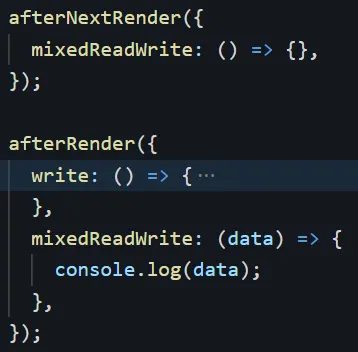
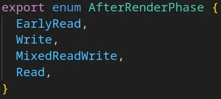
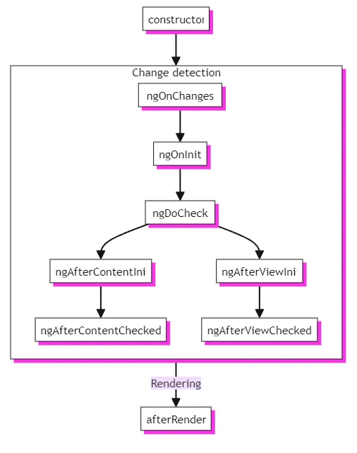
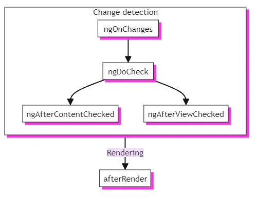
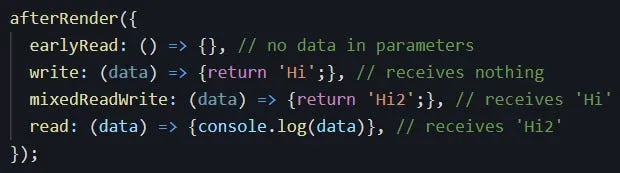
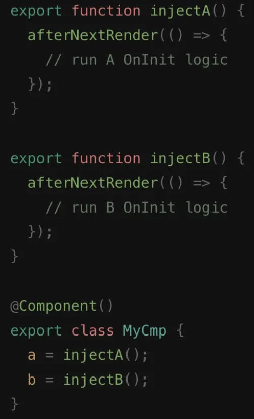

# Exploring Angular’s afterRender and afterNextRender Hooks

Angular cung cấp các hook vòng đời mạnh mẽ để tương tác thành phần, nhưng đôi khi bạn cần làm việc trực tiếp với DOM sau khi hiển thị. Đây là nơi afterRender và afterNextRender có ích.

## Understanding the Need

Hãy tưởng tượng bạn muốn tích hợp một thư viện biểu đồ của bên thứ ba dựa vào các phần tử DOM để trực quan. Các hook vòng đời tiêu chuẩn có thể không lý tưởng cho kịch bản này, vì thư viện có thể yêu cầu DOM phải được đặt đầy đủ trước khi khởi tạo. Đây là nơi afterRender và afterNextRender cung cấp giải pháp.

## Key Differences

Mặc dù cả hai hook đều xử lý các tác vụ sau khi kết xuất, nhưng có một sự khác biệt quan trọng:

- afterRender: cho phép bạn đăng ký một lệnh gọi lại thực thi sau mỗi chu kỳ kết xuất.
- afterNextRender: đăng ký một lệnh gọi lại thực thi CHỈ MỘT LẦN sau chu kỳ kết xuất tiếp theo, khi DOM được tải

## Choosing the Right Hook

- Sử dụng `afterNextRender` cho các thao tác DOM một lần như khởi tạo thư viện của bên thứ ba hoặc thiết lập trình quan sát phần tử.
- Sử dụng `afterRender` cho các tình huống mà bạn cần phản ứng với các thay đổi DOM thường xuyên, chẳng hạn như tự động điều chỉnh kích thước phần tử dựa trên nội dung.
  
Hãy nhớ rằng: việc sử dụng afterRender thường xuyên có thể ảnh hưởng đến hiệu suất, vì vậy hãy sử dụng nó một cách thận trọng. VAnd they both must be used inside an injection context. **Các móc này không hoạt động trên SSR hoặc kết xuất trước.**

## Order of Phases

Angular xác định các giai đoạn riêng biệt để truy cập DOM được kiểm soát trong quá trình kết xuất:

- EarlyRead: cho phép đọc dữ liệu từ DOM trước các thao tác ghi tiếp theo.
- Write: cho phép ghi dữ liệu vào DOM (tránh đọc trong giai đoạn này).
- MixedReadWrite: cho phép cả đọc và viết, nhưng sử dụng nó một cách thận trọng do các nhược điểm tiềm ẩn về hiệu suất.
- Read: cho phép đọc dữ liệu từ DOM (tránh ghi trong giai đoạn này).

## Callback Execution Order 

Các callback trong cùng một giai đoạn thực hiện theo thứ tự chúng được đăng ký.

Callbacks run after each render cycle, following this specific phase order:

1. earlyRead
2. write
3. mixedReadWrite
4. read

## During initialization (from angular.dev)

## Subsequent updates (from angular.dev)

## Parameter Passing Between Phases

Lệnh gọi lại giai đoạn đầu tiên (earlyRead) không nhận được tham số.

Mỗi lệnh gọi lại giai đoạn tiếp theo nhận giá trị trả về của lệnh gọi lại giai đoạn đã chạy trước đó dưới dạng tham số. Điều này cho phép phối hợp công việc trên nhiều giai đoạn.

## Profitable Examples

Dưới đây là một số trường hợp sử dụng thực tế cho các hook này:

- Khởi tạo thư viện của bên thứ ba: sử dụng `afterNextRender` để đảm bảo DOM đã sẵn sàng trước khi khởi tạo các thư viện như Chart.js.
- Thiết lập Element Observers: sử dụng `afterNextRender` để thiết lập IntersectionObserver hoặc ResizeObserver, vì các API này dựa trên sự hiện diện của phần tử trong DOM.
- Kích thước nội dung động: triển khai `afterRender` với giai đoạn Đọc để điều chỉnh kích thước phần tử dựa trên nội dung được tải động.
- Detaching Temporary Elements : sử dụng `afterNextRender` để xóa các phần tử tạm thời mà bạn đã thêm trong quá trình kết xuất (như dọn dẹp sau khi đóng phương ❌ thức ).

## Important Considerations 

- afterRender và afterNextRender dành cho các hoạt động dành riêng cho trình duyệt và sẽ không hoạt động trong quá trình server-side rendering.
- Cân nhắc sử dụng các chức năng Angular tích hợp sẵn như ngAfterViewInit cho các tác vụ khởi tạo thành phần bất cứ khi nào có thể.
- Mặc dù afterRender cho phép đọc DOM, nhưng hãy thận trọng do khả năng không khớp hydrat hóa giữa kết xuất máy chủ và máy khách.
- Chúng chỉ có thể được khai báo trong `injection context.`

> Bằng cách hiểu các khái niệm này, bạn có thể tận dụng afterRender và afterNextRender một cách hiệu quả để tạo ra sự tương tác liền mạch giữa các ứng dụng Angular của bạn và DOM.

## Custom Inject Function

You can encapsulate OnInit login into a custom inject function.

## Reference

https://medium.com/@amosisaila/angular-afterrender-afternextrender-new-phases-api-ddf2432455e2

https://stackblitz.com/edit/stackblitz-starters-a39kev?file=src%2Fmain.ts

https://stackblitz.com/edit/stackblitz-starters-rey9qy?file=src%2Fmain.ts