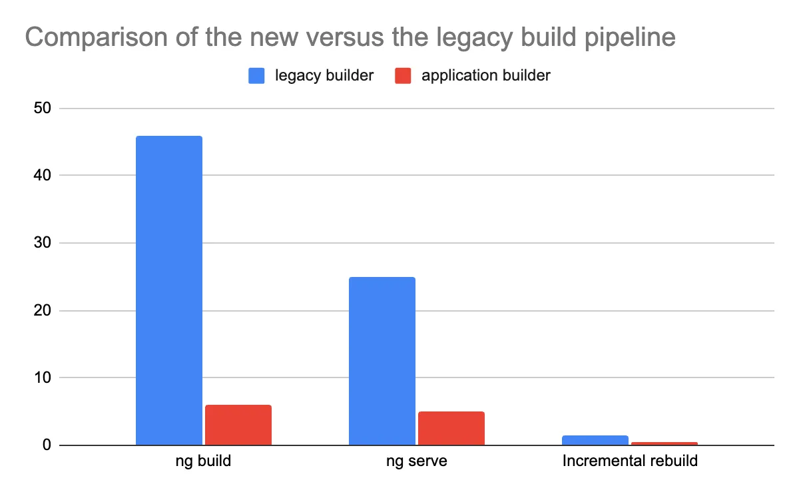

# Vite and esbuild the default for new projects

We wouldn’t have been able to enable SSR in Angular from the start without the fundamental changes we made in Angular CLI’s build pipeline!

In v16 we introduced developer preview of the esbuild plus Vite powered build experience. Since then a lot of developers experimented with it and some enterprise partners, `reported 67% build time improvement in some of their apps! `Today, we’re happy to announce that the new application builder graduates from developer preview and is enabled by default for all new applications!

In addition, we updated the build pipeline when using hybrid rendering. **With SSR & SSG you can observe up to 87% speed improvement in ng build and 80% faster edit-refresh loop in for ng serve.**

In a future minor version we’ll ship schematics to automatically migrate existing projects using hybrid rendering (client-side rendering with SSG or SSR). If you’d like to test the new application builder today check this guide in our documentation.