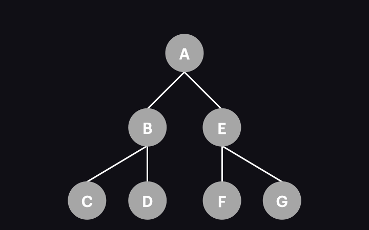
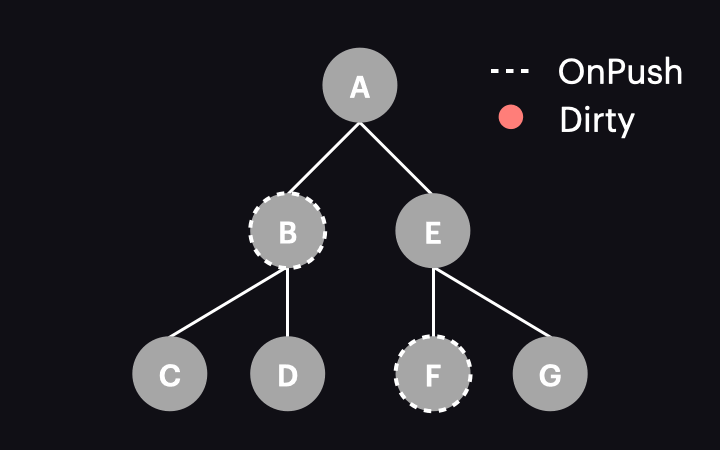
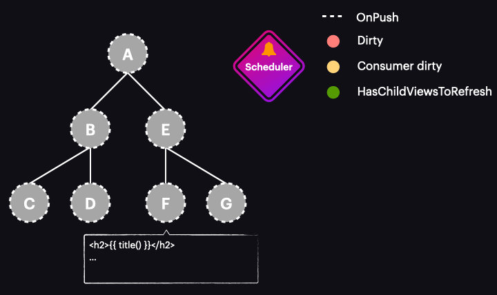
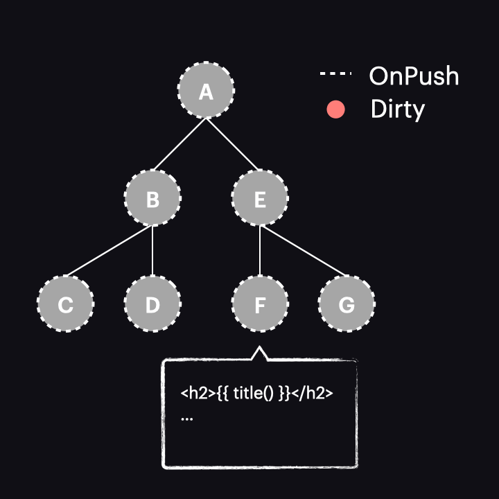
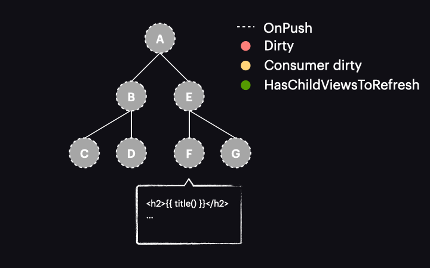

# Zoneless

Trong lịch sử, một thư viện có tên là zone.js đã chịu trách nhiệm kích hoạt phát hiện thay đổi của Angular. Thư viện này đi kèm với một số kinh nghiệm của nhà phát triển và nhược điểm về hiệu suất. Chúng tôi đã làm việc trong vài năm để hướng tới một cách sử dụng Angular không phụ thuộc vào zone.js và chúng tôi vô cùng vui mừng được chia sẻ các API thử nghiệm đầu tiên cho không vùng!

> Change detection has always been a hot topic, and it’s no wonder – it’s one of the core concepts of any framework.

Trong Angular, chủ đề này đặc biệt gây tranh cãi, chủ yếu là do bản chất 'kỳ diệu' của các cơ chế phát hiện thay đổi được hỗ trợ bởi Zone.js. Gần đây, lĩnh vực này đã trải qua những cập nhật đáng kể, đặc biệt là với việc giới thiệu các tín hiệu và khả năng chọn không sử dụng Zone.js. Hãy cùng khám phá những thay đổi này đã diễn ra như thế nào.

## Understanding Change Detection in Angular

Khi thảo luận về phát hiện thay đổi, tôi thấy hữu ích khi chia nó thành hai khía cạnh của việc thực hiện: 'khi nào' và 'như thế nào'. Hiểu cả hai yếu tố là điều cần thiết để hiểu quy trình phát hiện thay đổi tổng thể của Angular.

> Change detection là quy trình Angular sử dụng để đảm bảo giao diện người dùng của ứng dụng luôn được cập nhật với dữ liệu mới nhất. Điều này xảy ra tự động bất cứ khi nào có điều gì đó thay đổi trong ứng dụng của bạn, cho dù đó là hành động của người dùng, yêu cầu HTTP hay sự kiện hẹn giờ.
> Trong Angular, mỗi thành phần đều có cơ chế phát hiện thay đổi riêng, kiểm tra xem các giá trị trong mẫu của thành phần có thay đổi hay không và cập nhật DOM cho phù hợp.

### When?

Như bạn có thể mong đợi, phần 'khi nào' có liên quan đến lịch trình phát hiện thay đổi. Nó bao gồm thời điểm phát hiện thay đổi xảy ra và các yếu tố dẫn đến việc thực hiện nó.

Ngoài tùy chọn kích hoạt phát hiện thay đổi theo cách thủ công, công việc chủ yếu của người lập lịch là xử lý điều này cho chúng tôi. Kể từ những ngày đầu của Angular, bộ lập lịch phát hiện thay đổi đã dựa trên thư viện Zone.js. Thư viện này theo dõi các tác vụ khác nhau bằng cách vá các API của trình duyệt và chặn việc thực thi tác vụ.

`Đơn giản hóa một chút, chúng ta có thể nói rằng vùng của Angular (NgZone) kiểm tra xem hàng đợi microtask có trống hay không sau mỗi thao tác bị chặn kết thúc. Nếu có, nó phát ra một sự kiện đặc biệt, sau đó được sử dụng bởi bộ lập lịch, cuối cùng dẫn đến chạy phát hiện thay đổi. Chúng tôi sẽ không đi sâu vào chi tiết ở đây.`

Bài học quan trọng là hiểu rằng Zone.js cung cấp cho Angular các gợi ý về các hoạt động đã hoàn thành, nhắc framework phản ứng bằng cách chạy phát hiện thay đổi. Điều quan trọng là bộ đôi này không biết tại thời điểm này liệu có bất kỳ dữ liệu nào liên kết với mẫu đã thực sự thay đổi hay không, có nghĩa là việc làm mới có thể cần thiết hoặc không.

### How?

Phần 'làm thế nào' tập trung vào cơ chế thực hiện phát hiện thay đổi, bao gồm việc duyệt cây thành phần và quá trình kiểm tra các thay đổi. Sau khi lên lịch chạy phát hiện thay đổi, điều cần thiết là phải hiểu điều này có ý nghĩa gì đối với ứng dụng của chúng tôi, cách thực hiện và kết quả.

Cấu trúc thành phần của Angular tạo thành một cây. Trong cấu hình mặc định, các quy tắc sau mô tả cách quy trình được thực hiện ở cấp độ cao:

- Quá trình bắt đầu từ (các) thành phần gốc.
- Toàn bộ cây thành phần được kiểm tra các thay đổi, có nghĩa là mọi nút đều được truy cập.
- Hướng di chuyển là từ trên xuống dưới.
- Thứ tự chính xác của việc truy cập các nút tuân theo thuật toán tìm kiếm độ sâu đầu tiên (DFS).
  


Điều cần thiết là phải giải quyết một quan niệm sai lầm phổ biến: 
- Các thành phần Angular không được 'hiển thị lại' trong quá trình phát hiện thay đổi. 
- Điều này ngụ ý rằng toàn bộ DOM mẫu thành phần đã được thay thế, điều này không đúng. 
- Angular đủ thông minh để chỉ cập nhật các nút DOM (hoặc thậm chí chỉ các thuộc tính riêng lẻ) thực sự cần thay đổi.

### Change detection strategies – OnPush

Trong Angular, có hai chiến lược phát hiện thay đổi: `Default` và `OnPush`.  Các quy tắc được mô tả trong chương 'Làm thế nào?' phác thảo hiệu quả chiến lược Mặc định. Vậy, còn OnPush thì sao? Nó khác nhau như thế nào?

Các quy tắc cơ bản để đi qua cây thành phần vẫn giữ nguyên, nhưng OnPush cho phép chúng ta 'cắt' hoặc bỏ qua một số nhánh trong quá trình phát hiện thay đổi. Điều này dẫn đến ít hoạt động được thực hiện hơn, dẫn đến hiệu suất tốt hơn.

Khi một thành phần sử dụng OnPush, nó (và các thành phần con của nó) sẽ không phải lúc nào cũng được kiểm tra trong quá trình phát hiện thay đổi. Thay vào đó, chúng sẽ chỉ được kiểm tra khi được đánh dấu là 'bẩn'. Toàn bộ nhánh bị bỏ qua nếu thành phần không được đánh dấu là bẩn.

Có thể kết hợp các thành phần `Default` và `OnPush` trong ứng dụng; ví dụ: nếu một thành phần mẹ là OnPush và một thành phần con là Default, con vẫn sẽ được kiểm tra các thay đổi miễn là nó được truy cập (có nghĩa là cha bị bẩn và không bị cắt).

Tại thời điểm này, chúng ta cũng có thể xem lại quy tắc rằng 'toàn bộ cây thành phần được kiểm tra các thay đổi, có nghĩa là mọi nút đều được truy cập'. Điều này không còn đúng nếu chúng ta sử dụng các thành phần OnPush, tạo thành ngoại lệ của chúng ta.



## Zones and their role

Angular theo truyền thống đã sử dụng zone.js để vá các hoạt động không đồng bộ như:

- HTTP requests (success/error).
- Event listeners (e.g., button clicks).
- Timers like setTimeout or setInterval.

Khi bất kỳ thao tác nào trong số này được hoàn thành, zone.js sẽ tự động kích hoạt cơ chế phát hiện thay đổi của Angular, đảm bảo giao diện người dùng luôn đồng bộ. Điều này giúp việc phát triển dễ dàng hơn, vì các nhà phát triển không cần phải lo lắng về việc cập nhật giao diện người dùng theo cách thủ công.

## The problems with Zones

While zone.js simplifies development, it introduces some challenges:

- Performance overhead: Bằng cách patching tất cả các hoạt động không đồng bộ, zone.js thêm chi phí không cần thiết, đặc biệt là trong các ứng dụng lớn hoặc hiệu suất cao.
- Debugging complexity: Gỡ lỗi các vấn đề trở nên khó khăn hơn vì zone.js sửa đổi cách hoạt động của các hoạt động không đồng bộ.
- Compatibility issues: Một số API trình duyệt hiện đại và thư viện của bên thứ ba không hoạt động tốt với zone.js.
- Unnecessary change detection: Tính năng phát hiện thay đổi của Angular chạy ngay cả khi trạng thái của ứng dụng không thay đổi, dẫn đến lãng phí tài nguyên.

## The Zoneless revolution in Angular

Với việc phát hành Angular v19, framework đã giới thiệu một chế độ không vùng thử nghiệm để giải quyết những vấn đề này. Chế độ không vùng cho phép Angular chạy mà không cần zone.js, cho phép các nhà phát triển kiểm soát nhiều hơn thời điểm và cách phát hiện thay đổi xảy ra.

### What does Zoneless mode do?

In zoneless mode:

- Angular không còn tự động theo dõi các hoạt động không đồng bộ.
- Nhà phát triển phải kích hoạt phát hiện thay đổi theo cách thủ công khi dữ liệu thay đổi.
- Ứng dụng trở nên gọn gàng hơn và nhanh hơn vì không có chi phí từ zone.js.

## How to use Zoneless mode

### Step 1: Disable Zone.js

1. To disable zones, start by removing the zone.js library from your application in `angular.json`.

```bash
Update polyfills.ts: Remove or comment out the import for zone.js:
   // polyfills.ts
   // Remove or comment out the following line:
   // import 'zone.js';
```

2. Remove from Dependencies: Check your package.json and remove zone.js from the dependencies section:
```bash
{
    "dependencies": {
    "zone.js": "^0.12.0" // Remove this dependency
    }
```
3. Uninstall the Library: Run the following command to uninstall zone.js completely:

```bash   
npm uninstall zone.js 
```

### Step 2: Bootstrap without Zone.js

Angular provides a dedicated function, provideExperimentalZonelessChangeDetection(), to enable zoneless mode in your application. 
This function ensures that Angular initializes without zone.js and uses the experimental zoneless change detection.

Here’s how to configure it in your main.ts file:

```ts
import { bootstrapApplication } from '@angular/platform-browser';
import { provideExperimentalZonelessChangeDetection } from '@angular/core';
import { AppComponent } from './app/app.component';

bootstrapApplication(AppComponent, {
  providers: [
    provideExperimentalZonelessChangeDetection(), // Enable zoneless change detection
  ],
}).catch(err => console.error(err));
```

### Step 3: Manually trigger change detection

Sau khi các vùng bị tắt, Angular sẽ không còn tự động chạy phát hiện thay đổi nữa. Bạn cần kích hoạt nó theo cách thủ công khi xảy ra thay đổi trạng thái.

#### Sử dụng ChangeDetectorRef

Dịch vụ ChangeDetectorRef cho phép bạn gọi phát hiện thay đổi ở cấp độ thành phần.
Ngoài ra, phương thức markForCheck() rất hữu ích trong các tình huống mà bạn muốn Angular lên lịch phát hiện thay đổi cho các thành phần bằng chiến lược phát hiện thay đổi OnPush:

```ts
import { Component, ChangeDetectorRef } from '@angular/core';

@Component({
  selector: 'app-root',
  template: `
    <div>
      <h1>Counter: {{ counter }}</h1>
      <button (click)="incrementCounter()">Increment</button>
    </div>
  `,
})
export class AppComponent {
  counter = 0;

  constructor(private cdr: ChangeDetectorRef) {}

  incrementCounter() {
    this.counter++;
    this.cdr.markForCheck(); // Mark the component for checking during the next change detection cycle
  }
}
```

#### Using ApplicationRef

```ts
import { Component, ApplicationRef } from '@angular/core';

@Component({
  selector: 'app-global-tick',
  template: `
    <button (click)="updateState()">Update State</button>
    <p>{{ message }}</p>
  `,
})
export class GlobalTickComponent {
  message = 'Initial State';

  constructor(private appRef: ApplicationRef) {}

  updateState() {
    this.message = 'Updated State';
    this.appRef.tick(); // Trigger change detection globally
  }
}
```



### Step 4: Optimize with Signals

- Tín hiệu Angular, được giới thiệu với mô hình phản ứng mới của Angular, là một người bạn đồng hành tuyệt vời với chế độ không vùng. 
- Tín hiệu theo dõi các thay đổi trạng thái một cách hiệu quả và tự động cập nhật giao diện người dùng mà không cần gọi thủ công để phát hiện thay đổi.

```ts
import { Component, signal } from '@angular/core';

@Component({
  selector: 'app-signal-demo',
  template: `
    <h1>Signal Counter: {{ count() }}</h1>
    <button (click)="increment()">Increment</button>
  `,
})
export class SignalDemoComponent {
  count = signal(0);

  increment() {
    this.count.set(this.count() + 1);
  }
}
```

Điều tốt nhất chúng ta có thể đạt được trong trường hợp này là sử dụng nó với OnPush cho tất cả các thành phần, do đó thu hẹp việc phát hiện thay đổi chỉ còn một đường dẫn duy nhất:



Mọi thứ thay đổi mạnh mẽ với Angular 17 hoặc mới hơn. Trong các phiên bản này, đánh dấu người tiêu dùng phản ứng là bẩn không còn đánh dấu toàn bộ thành phần là bẩn. Thay vào đó, một hàm mới có tên là markAncestorsForTraversal được kích hoạt. Hàm này di chuyển từ thành phần qua tổ tiên của nó đến thành phần gốc (như markViewDirty đã làm), nhưng thay vì đánh dấu chúng là bẩn, nó để nguyên thành phần hiện tại (vì người tiêu dùng phản ứng đã được đánh dấu là bẩn). Tuy nhiên, tổ tiên của nó nhận được một cờ HasChildViewsToRefresh mới. Nó trông như thế này:


Cơ chế di chuyển phát hiện thay đổi cũng đã được cập nhật. Bây giờ, khi quá trình bắt đầu với cây ở trạng thái này, nó sẽ đi qua các thành phần A và E mà không thực hiện phát hiện thay đổi trên chúng. Điều này là do chúng là OnPush nhưng không bẩn. Nhờ cờ HasChildViewsToRefresh mới, Angular tiếp tục truy cập các nút được đánh dấu bằng cờ này và tìm kiếm thành phần yêu cầu phát hiện thay đổi (trong ví dụ của chúng tôi, đó là thành phần có người tiêu dùng phản ứng được đánh dấu là bẩn). Khi nó đến thành phần F, nó thấy rằng người tiêu thụ phản ứng của nó bị bẩn, vì vậy thành phần này được phát hiện thay đổi - và nó là thành phần duy nhất!



Khá tuyệt, phải không? Chúng ta đã đi từ thay đổi phát hiện toàn bộ đường dẫn của các thành phần sang chỉ một thành phần. Mặc dù đây là một ví dụ đơn giản về cây thành phần, nhưng hiệu suất tăng trong các ứng dụng thực tế đáng kể hơn nhiều.

## Coalescing by default

Bắt đầu từ phiên bản 18, chúng tôi đang sử dụng cùng một bộ lập lịch cho các ứng dụng không vùng và các ứng dụng sử dụng zone.js có bật kết hợp. Để giảm số chu kỳ phát hiện thay đổi trong ứng dụng zone.js mới, chúng tôi cũng đã bật hợp nhất vùng theo mặc định.

Hành vi này chỉ được bật cho các ứng dụng mới vì nó có thể gây ra lỗi trong các ứng dụng phụ thuộc vào hành vi phát hiện thay đổi trước đó. Kết hợp làm giảm chu kỳ phát hiện thay đổi không cần thiết và cải thiện đáng kể hiệu suất cho một số ứng dụng.

Để chọn tham gia hợp nhất sự kiện cho các dự án hiện có, hãy định cấu hình nhà cung cấp NgZone của bạn trong bootstrapApplicationbootstrapApplication:

```ts
bootstrapApplication(App, {
  providers: [
    provideZoneChangeDetection({ eventCoalescing: true })
  ]
});
```

### Components support zoneless

Chúng tôi đã kích hoạt hỗ trợ không vùng trong Angular CDK và Angular Material. Điều này cũng giúp chúng tôi khám phá và đánh bóng một số cạnh thô với mô hình không vùng.

## Tại sao chế độ Zoneless lại mang tính cách mạng

- Tăng hiệu suất: Các ứng dụng trở nên nhanh hơn và hiệu quả hơn bằng cách loại bỏ chi phí liên quan đến vùng.
- Developer control: Chế độ không vùng cho phép bạn quyết định thời điểm cập nhật giao diện người dùng, dẫn đến các ứng dụng được tối ưu hóa tốt hơn.
- Compatibility: Hoạt động liền mạch với các API hiện đại và thư viện của bên thứ ba.
- Khả năng phản ứng nâng cao: Kết hợp với tín hiệu, chế độ không vùng giúp đơn giản hóa việc quản lý trạng thái và cải thiện khả năng phản hồi của ứng dụng.

## Create a Zone-Less App by Default?

```bash
ng new my-app --experimental-zoneless
```

## Reference 

<https://dev.to/soumayaerradi/angular-change-detection-with-zoneless-413f>

<https://angular.love/the-latest-in-angular-change-detection-zoneless-signals>

<https://dev.to/danywalls/angular-19-and-zoneless-1of9>
